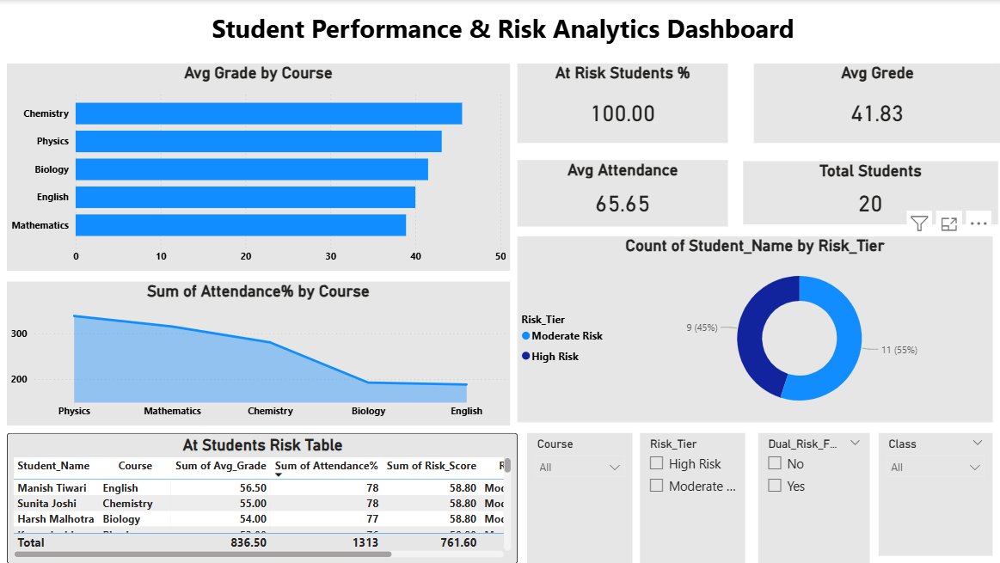

# Student-Performance-Analytics
Analyzing student data using SQL, Power BI and AI recommendations

# Student Performance Analytics 

## Goal
Identify at-risk students early and improve academic outcomes
using data analytics and AI recommendations.

---

## Tools Used
| Tool | Purpose |
|------|---------|
| MySQL | Database and SQL queries |
| Power BI | Dashboard and KPIs |
| ChatGPT | AI intervention plans |
| Excel | Data preparation |

---

## Skills Demonstrated
- SQL: CTEs, CASE statements, Window Functions
- Data Segmentation and Risk Scoring
- Power BI Dashboard Design
- AI Recommendations using ChatGPT

---

## Dataset
- 50 students data
- 5 courses: Mathematics, Physics, Chemistry, Biology, English
- Columns: Grade, Attendance, Submission Rate, Risk Score

---

## What I Did

### 1. SQL Analysis
- Identified low performing students using CTEs
- Created risk scoring logic using CASE statements
- Used RANK() and AVG() window functions
- Generated Risk Summary and Course Analysis

### 2. Risk Scoring Model
- Grade Score → 40% weight
- Attendance Score → 35% weight
- Submission Score → 25% weight
- Risk Tiers: High Risk, Moderate Risk, Needs Monitoring, On Track

### 3. Power BI Dashboard
- KPI Cards: Total Students, % At Risk, Avg Grade, Avg Attendance
- Charts: Risk Distribution, Attendance Trend, Course Analysis
- At-Risk Students Table with Follow-up Dates

### 4. AI Intervention Plans
- Used ChatGPT to generate personalized intervention plans
- Root causes identified for each at-risk student
- Priority actions with deadlines
- Student messages for advisors

---

## Key Findings
- 18% students are High Risk
- Average grade: 63.4%
- Average attendance: 79.1%
- Dual risk students need immediate attention

---

## Files in This Repository
| File | Description |
|------|-------------|
| Student_Performance_Analytics.xlsx | Main dataset with 4 sheets |
| queries.sql | All SQL queries used |
| dashboard_screenshot.png | Power BI dashboard |

---

## Dashboard Preview

---

## Contact
- GitHub: fayajunddinshaikh05

